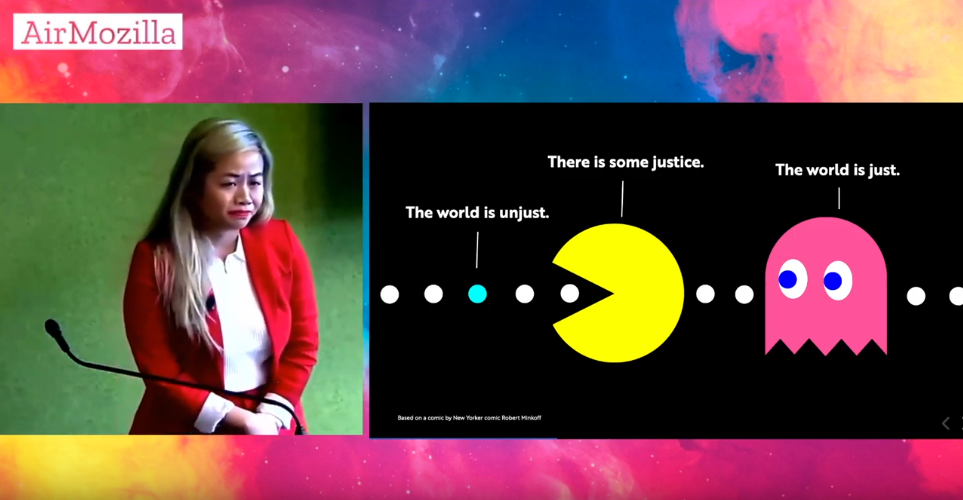

# Static site generation with JS, design, and justice

WOW.

Was putting the cart before the horse and thinking about a way to create/build/organize my "personal knowledge base" which doesn't actually exist yet.

Vue is cool, but that bundle, that damn bundle.

Jekyll is dumb in that it just does something to create a static thing. Vue, etc, seem to be a solution to a different problem, although, yes, the prerender-spa-plugin.

So I went on another quest to search for js-based static site generators.

Came across 11ty, and briefly looked at the home page. There was a funny logo in the top right corner of an opossum and a balloon, which was a link to a tweet about it. Further down this guy's twitter log, was a link to a blog post that looked intriguing, [A Modern CSS Reset](https://hankchizljaw.com/wrote/a-modern-css-reset/) by Andy Bell. Smart, informed stuff actually.

Browsing Andy's GH account, I noticed he made a project called [Personalsit.es](https://github.com/hankchizljaw/personalsit.es). How awesomely serendipitous I though, since I'm in the market for design and build inspiration for upgrading my personal site.

So I browsed it a bit (and even saw a name that I recognized from that Ali Spittel list of personal sites that I found this past weekend). Then I happened to click on a name because of the url, henry.codes.

WHOLLY SHIT.

Beautiful, magazine layout with goth and roman inspiration. Really great stuff, down to much detail.

His work portfolio, at just 3 projects deep, was CRAZY, especially given the project for overhauling an 'online dominatrix' website.

But the real kicker, is The Diff, a twitch stream where he recreates famous poster art on the web, with TatianaMac.

Tatiana's site is amazing too. The design, yes. But the language is what really grabbed me - her absolute control of knowing what she really means, even though she also seems to admit confusion in her own personal life.

Her [speaker rider](https://gist.github.com/tatianamac/493ca668ee7f7c07a5b282f6d9132552) is an expression of the fight for justice that begins to rival my first master's environment, yet all on a single gist.

And there's the talk [How Privilege Defines Performance ](https://www.youtube.com/watch?v=tmYn98Z9CyM), which yielded the following poingant illustration:

## Links to pursue further

- https://github.com/hankchizljaw/personalsit.es
- https://tatianamac.com/
- https://henry.codes/
